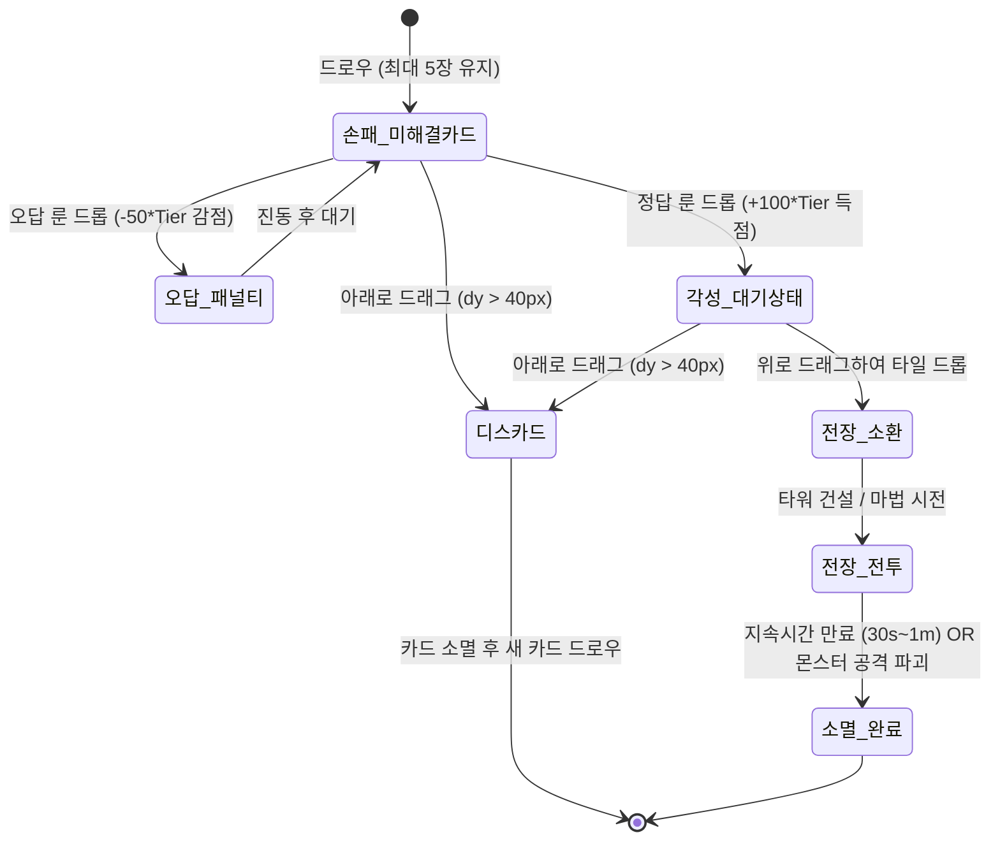

# 📜 산수 카드 디펜스 - 문제 카드(Problem Card) 종합 기획 및 개발 명세서

> 본 문서는 **산수 카드 디펜스(Arithmetic Card Defence)**의 핵심 게임플레이 요소인 **문제 카드(Problem Card)**의 기획 의도, 생명주기(Lifecycle), 상호작용 메커니즘, 8단계 수학 교육과정, 26종 아군/마법 카드 스펙, 데이터 구조 및 기술 아키텍처를 총망라한 종합 명세서입니다.  
> **(★ 최신 업데이트: 덫류 비차단 규칙, 방어벽 아군 비간섭/공존배치 규칙, 10종 신규 아군 유닛 추가 반영 완료)**

---

## 📌 목차
1. [개요 및 기획 의도](#1-개요-및-기획-의도)
2. [문제 카드의 비주얼 구성 (Card Anatomy)](#2-문제-카드의-비주얼-구성-card-anatomy)
3. [문제 카드 생명주기 및 조작 흐름 (Lifecycle & Interaction)](#3-문제-카드-생명주기-및-조작-흐름-lifecycle--interaction)
   - [3.1 드로우 및 손패 유지](#31-드로우-및-손패-유지)
   - [3.2 답안 룬 합성 (정답 vs 오답)](#32-답안-룬-합성-정답-vs-오답)
   - [3.3 수동 전술 배치 및 멀티레이어 공존 규칙 (Manual Placement)](#33-수동-전술-배치-및-멀티레이어-공존-규칙-manual-placement)
   - [3.4 덫(Trap)의 적군 비차단 메커니즘](#34-덫trap의-적군-비차단-메커니즘)
   - [3.5 방어벽(Wall)의 아군 비간섭 & 보호 메커니즘](#35-방어벽wall의-아군-비간섭--보호-메커니즘)
   - [3.6 아군 유닛 지속 타이머 및 자동 소멸 (30초~1분)](#36-아군-유닛-지속-타이머-및-자동-소멸-30초1분)
   - [3.7 아래로 끌어내려 버리기 (Discard)](#37-아래로-끌어내려-버리기-discard)
4. [8단계 스코어 승급 및 수학 연산 체계](#4-8단계-스코어-승급-및-수학-연산-체계)
5. [티어별 카드 총괄 도감 (유닛 16종 + 마법 10종 = 총 26종)](#5-티어별-카드-총괄-도감-유닛-16종--마법-10종--총-26종)
6. [상단 답안 룬 풀(Rune Rack) 알고리즘](#6-상단-답안-룬-풀rune-rack-알고리즘)
7. [데이터 모델 및 기술 구조 (Technical Architecture)](#7-데이터-모델-및-기술-구조-technical-architecture)

---

## 1. 개요 및 기획 의도

**문제 카드(Problem Card)**는 게임 플레이어가 조작하는 가장 핵심적인 인터랙션 매개체입니다. 
단순한 타워 디펜스에서 탈피하여 다음 **3중 융합 학습 & 전술 디펜스 경험**을 제공합니다:

1. **초등 저학년 기초 수학 연산**: 연산 속도와 정확도를 요구하는 퍼즐 요소.
2. **필수 영단어(Vocabulary) 각인**: 카드를 풀 때마다 소환 유닛/마법의 핵심 영단어 반복 노출.
3. **전술적 수동 배치 디펜스**: 정답으로 각성시킨 유닛을 원하는 타이밍과 최적의 전장 타일에 직접 배치하는 전략적 플레이.

---

## 2. 문제 카드의 비주얼 구성 (Card Anatomy)

카드는 하스스톤(Hearthstone) 스타일의 입체적인 판타지 TCG 프레임으로 렌더링되며, **[미해결 상태]**와 **[각성(Charged) 상태]**에 따라 UI 구성요소가 동적으로 변화합니다.  
**(★ 최신 업데이트: 영단어 리본 배너를 상단 헤더로 올리고, 포트레이트 아이콘을 중앙으로 재배치하여 이모지 아이콘 크기를 기존 대비 60% 이상 대폭 확대(16px → 25~30px) 적용)**

```
+-----------------------------------+
| (1)[마나 크리스탈] (2)[영단어 리본 배너]|
|    [티어 1~8]           ARCHER     |
|                                   |
|      (3) [대형 포트레이트 프레임]    |
|             (  🏹  /  🛡️  )        |
|          (25~30px 대폭 확대)       |
|                                   |
|   +---------------------------+   |
|   |   (4) [대형 수학 문제]     |   |
|   |           8 + 2           |   |
|   |   (대폭 확대 / =? 제거)    |   |
|   +---------------------------+   |
|                                   |
| (5)[공격력 보석]     (6)[체력 보석]|
|      (25)                 (40)    |
+-----------------------------------+
```

### 상세 구성요소:
- **(1) 마나 크리스탈 (Tier Crystal)**: 좌측 상단 팔각형 블루 크리스탈. 카드의 등급(1~8단계)을 표시.
- **(2) 영단어 리본 배너 (Ribbon Banner)**: 카드의 영단어 명칭(`ARCHER`, `KNIGHT`, `LURKER`, `SNIPER` 등). 카드 최상단 헤더 타이틀 바 형태로 배치되어 마나 크리스탈과 함께 카드의 정체성을 한눈에 전달.
- **(3) 대형 포트레이트 아이콘 (Portrait Frame)**: 유닛 및 마법의 상징 아이콘(이모지). 상단 배너 아래 중앙에 넓게 배치되어 **아이콘 크기가 대폭 확대(25~30px)**되었으며, 티어별 고유 프레임 색상(1~8티어) 및 각성 시 생생한 에메랄드/골드 글로우 아우라가 발산됨.
- **(4) 중앙 디스크립션 박스 (Desc Box)**:
  - **미해결 상태**: 군더더기(`=?`, `상단 룬 드래그`)를 완전히 제거하고 **`8 + 2` 형태의 대형 연산 문제만 가로·세로 중앙에 시인성 높게 대폭 확대(약 2배)** 렌더링.
  - **각성 상태**: `✨ [유닛명]` + `⏱️ 40s / 전장 배치` 가이드.
- **(5, 6) 스탯 보석 (Stat Gems)**: 유닛형 카드의 하단 좌측 주황색(공격력), 우측 녹색(체력/10) 수치 표시. 마법 카드는 보석이 숨김 처리됨.

---

## 3. 문제 카드 생명주기 및 조작 흐름 (Lifecycle & Interaction)



### 3.1 드로우 및 손패 유지
- 플레이어의 손패(`hand`)는 항상 **5장의 카드를 유지**합니다.
- 카드가 사용되거나 디스카드되면 0.3초 후 덱에서 플레이어의 **현재 점수(티어)**에 맞는 새 카드가 자동으로 보충됩니다.

### 3.2 답안 룬 합성 (정답 vs 오답)
- 화면 상단의 **답안 룬(Rune Rack)** 중 하나를 클릭/터치하여 원하는 문제 카드로 드래그합니다.
- **정답 판정 시**:
  - `card.charged = true` (각성 상태로 전환).
  - 스코어 획득: `+100 × Tier` 점.
  - 연속 정답 콤보(`combo`) +1 증가.
  - 사용된 답안 룬은 소모되고 랙이 갱신됨.
  - **★ 자동 배치 금지**: 전장에 즉시 유닛이 소환되지 않고, 카드가 각성 상태로 **손패에 그대로 머물며** 플레이어의 배치 명령을 기다립니다.
- **오답 판정 시**:
  - 스코어 감점: `-50 × Tier` 점 차감 (최저 0점 보장).
  - 콤보가 `0`으로 즉시 초기화.
  - 카드가 좌우로 거칠게 흔들리는 `wrong-shake` 애니메이션 발생.
  - **★ 화면 약진동 (`Screen Shake`)**: 오답 합성 1회마다 화면 전체가 약하게 흔들림 (`addScreenShake(0.35, 6)`).
  - **★ 아군 지속시간 10% 감소 페널티**: 현재 전장에 배치된 모든 아군 타워/유닛의 잔여 지속시간이 **10% 즉각 삭감**되며 머리 위에 `-10% ⏱️` 경고 파티클 발생.
  - 붉은색 스파크 파티클과 `-50점 & 아군 지속시간 -10%` 토스트 출력.

### 3.3 수동 전술 배치 및 멀티레이어 공존 규칙 (Manual Placement)
- 각성된 카드를 전장(위쪽)으로 드래그하면 반투명 소환 프록시가 마우스/손가락을 따라 이동하며, 마우스 아래의 6×7 그리드 타일이 하이라이트됩니다.
- **멀티레이어 공존 배치 시스템 (Multi-Layer Coexistence)**:
  - 타일은 **3가지 독립 레이어**로 구성됩니다:
    1. **바닥 레이어 (`trap`)**: 바닥 맹독 덫 (적을 막지 않고 밟힘)
    2. **방어 레이어 (`defense`)**: 타이탄 방벽 (적군의 진격을 전방에서 저지)
    3. **유닛 레이어 (`unit`)**: 궁수, 성기사, 드론, 캐논, 탱크 등 공격형 아군 유닛
  - **공존 허용**: 동일 타일에 [방어벽 + 아군 유닛 + 덫]이 함께 공존할 수 있습니다!
  - **중복 방지**: 동일 레이어의 중복(예: 한 타일에 궁수 2기, 또는 방어벽 2개 설치)은 엄격히 차단됩니다.

#### 3.4 덫(Trap) 및 럴커(Lurker)의 적군 비차단 메커니즘
> **규칙 1: 덫류의 카드는 적군을 막지 않는다.**
- **기본 맹독 덫(`TRAP`)**: 지면에 설치되는 바닥 오브젝트로, 적군이 통과할 때 멈추지 않고 밟고 지나가며 **80% 감속(Slow)** 및 **지속 맹독 피해**를 받습니다.
- **지하 매복형 럴커(`LURKER`)**: 지중에 잠복하는 매복형 덫으로, 통과하는 적군을 가로막지 않으면서 **상/하/좌/우 4방향으로 날카로운 가시(Spines)를 일제히 분출**하여 인근 레인의 적들에게까지 강력한 관통 피해를 입힙니다.

### 3.5 방어벽(WALL, WALL+2)의 좌우 확장 구축 & 기지 수리 메커니즘
> **규칙 2: 방어벽은 아군에게 영향을 주지 않는다.**
- 방어벽은 오직 **적군의 진격을 전방에서 가로막는 용도**로만 작동합니다.
- **좌우 확장 자동 설치**:
  - `WALL`: 설치 시 지정 레인을 중심으로 **좌우 +1칸씩(총 3칸: `lane-1, lane, lane+1`)** 견고한 석벽을 동시 구축합니다.
  - `WALL+2`: 설치 시 지정 레인을 중심으로 **좌우 +2칸씩(총 5칸: `lane-2 ~ lane+2`)** 광역 방벽 라인을 전개합니다.
- **기지 체력 즉각 수리**:
  - `WALL` 설치 시 아군 본진(캐슬) 체력을 **+15 HP 즉각 수리**합니다.
  - `WALL+2` 설치 시 아군 본진(캐슬) 체력을 **+30 HP 즉각 수리**합니다.
- **투사체 및 전사 관통**: 방어벽 뒤나 방어벽과 같은 타일에 배치된 아군 유닛의 투사체(화살, 포탄, 레이저)는 방벽을 자유롭게 통과하며, 벙커에서 출격한 기사단 전사들 또한 방벽을 자유롭게 통과하여 북쪽 적진으로 진격합니다.
- **어그로 최우선 흡수**: 방어벽과 아군 유닛이 동일 타일에 공존할 경우, 다가오는 적군은 아군 유닛 대신 **방어벽(체력 3,000)을 우선적으로 공격**하여 아군 공격 유닛을 안전하게 보호합니다.

### 3.6 아군 유닛 지속 타이머 및 자동 소멸 (30초~1분)
- 소환된 모든 아군 유닛은 **35초 ~ 60초(1분)**의 유효 지속시간(`maxLifeTime`)을 가집니다.
- **실시간 HUD 게이지**:
  - 유닛 발판 바로 아래에 **체력바(HP)**, 그 밑에 **하늘색 타이머 게이지 바**, 그리고 **`⏱️ XXs` 잔여 초 텍스트**가 실시간으로 표시됩니다.
  - 잔여 시간 10초 이하 진입 시 주황색, 5초 이하 진입 시 붉은색으로 게이지 색상이 변경됩니다.
- **소멸 임박 점멸**: 잔여 시간 3초 이하 진입 시 유닛 전체가 빠르게 깜빡입니다.
- **시간 만료 소멸**: 타이머가 0이 되면 유닛이 전장에서 즉각 제거되며, 은백색 스파크와 함께 `⏳ 지속시간 만료` 플로팅 텍스트가 떠오릅니다.

### 3.7 아래로 끌어내려 버리기 (Discard)
- 풀기 어려운 문제 카드나 현재 전황에 필요 없는 각성 카드는 **카드를 아래로 40px 이상 끌어내리면** 즉시 디스카드됩니다.
- 전용 디스카드 사운드와 붉은색 분해 파티클이 발생하며, 0.22초 후 새로운 카드가 보충됩니다.

### 3.8 맨 처음 시작 시 사용법 화살표 튜토리얼 UI (한 턴 이후 자동 소멸)
- **발동 시점**: 게임/스테이지가 시작될 때 첫 번째 미해결 문제 카드와 상단 답안 룬 풀에서 그에 해당하는 정답 룬을 자동으로 매칭하여 안내합니다.
- **시각 연출**:
  1. **상단 가이드 배너**: `💡 정답 [X] 룬을 아래 문제 [Y + Z] 카드로 드래그하세요!` 팝업 배너 표시.
  2. **황금/청록 하이라이트**: 정답 룬스톤에는 황금빛 맥동 펄스(`tutorial-source-highlight`), 대상 문제 카드에는 청록빛 맥동 펄스(`tutorial-target-highlight`)가 점멸.
  3. **흐르는 점선 화살표 궤적 (SVG Flow Path)**: 정답 룬에서 출발하여 문제 카드의 공식 박스로 부드럽게 이어지는 베지어 곡선 점선 화살표 및 손가락 포인터(`👇`)가 실시간 드래그 경로 안내.
- **자동 소멸 조건 (한 턴 이후 소멸)**:
  - 플레이어가 정답 룬을 카드에 드롭하여 문제를 풀거나(정답/오답 판정), 카드를 디스카드하거나, 유닛을 배치하는 등 **첫 턴 인터랙션을 완료하는 즉시 부드럽게 페이드아웃(`opacity: 0`)되며 전장에서 영구 제거**됩니다.

### 3.9 x2 배수/강화 카드 (보드 위 타워/유닛 대상 버프)
- 전장에 배치된 기존 아군 타워나 유닛 위에 드래그하여 드롭하면 발동되는 **영구 강화 버프 카드**입니다.
- **중첩 제한**: 동일 대상에 최대 **3개까지 중첩(`⚡x1`, `⚡x2`, `⚡x3`)** 적용됩니다.
- **지속시간 연장**:
  - 기본 모든 유닛/타워: 남은 지속시간 **+30% 증가**.
  - `TANK, WALL, TESLA, MORTAR, TITAN`: 남은 지속시간 **+50% 대폭 증가**.
- **유닛군별 특화 효과**:
  - `SNIPER, ARCHER, MORTAR`: 화살/포탄/탄환을 **x2배수 부채꼴(Fan-shot)** 형태로 광각 난사합니다.
  - `KNIGHT(벙커), PALADIN`: 전사들이 황금빛 중갑옷을 착용하고 **체력이 2배 증가(280 HP, 방어력 대폭 상승)**하여 최전방 결전을 수행합니다.

### 3.10 KNIGHT 기사단 벙커 요새 & 아군 전사 출격 (방벽 자유 통과)
- 배치 시 튼튼한 군사 요새인 **기사단 벙커(`🏰`)**를 건설합니다.
- 벙커에서 주기적으로(일반 2.5초, 피버 1.4초마다) 검과 방패를 든 **기사단 전사(`Warrior`)**들이 뛰쳐나와 북쪽 적진을 향해 전진합니다.
- **방벽 무간섭 통과**: 전사는 아군 방어벽(`WALL`)을 자유롭게 통과하여 지나갈 수 있습니다.
- **전방 근접 교전**: 전방에 몬스터를 마주치면 즉각 근접 백병전을 벌여 적을 베어 넘기고, 몬스터의 공격을 직접 받아내며 성벽 라인을 든든히 지켜냅니다.

### 3.11 하늘(공중) 비행 몬스터 시스템 - 추후 개발로 일시 분리
> **[안내] 사용자 요청에 따라 공중 비행 몬스터(다크 배트, 공중 팬텀, 스카이 와이번)는 전장에서 일시 제거되었으며, 향후 전용 기믹 및 대공 전술 시스템 개편과 함께 추후 개발될 예정입니다.**
- **현재 적용 상태**:
  - 3분, 4분, 5분+ 웨이브에서 공중 몬스터 스폰이 비활성화되었으며, 지상 몬스터 군단(좀비 러너, 고블린, 아머드 오크, 스피드 울프, 골렘)으로 대체 편성됩니다.
  - 아군 타워 및 유닛(`ARCHER`, `LASER`, `SNIPER`, `DRONE` 등)은 지상 몬스터 전열을 안정적으로 타겟팅하여 일관된 지상 디펜스 화력을 집중합니다.
  - 바닥 덫(`TRAP`, `LURKER`) 및 기사단 전사(`Warrior`) 또한 지상 몬스터와의 교전에 전념합니다.

### 3.12 티어 승급 후 하급 티어 카드 지속 순환 및 타워형 카드 등장 가중치
- **하급 티어 카드 지속 순환 (Tier Mixing Draw)**:
  - 티어가 5~8티어로 승급하더라도 초반 필수 방어 카드(`WALL`, `ARCHER`, `KNIGHT`, `TRAP` 등)가 완전히 고갈되지 않고 **항상 일정 비율(약 60%)로 지속 순환**됩니다.
  - **드로우 확률 분포**:
    - 현재 도달한 최고 티어 카드: **40%**
    - 직전 티어 카드: **25%**
    - 1티어 ~ (현재티어-2) 하급 티어 카드: **35%** (모든 하위 티어에 골고루 균등 배분)
  - 이를 통해 플레이어는 고난도 연산 카드와 함께 즉각 시전이 가능한 기초 연산 카드를 섞어 쓰며 위기 상황에 대처할 수 있습니다.
- **타워형 카드 등장 확률 3.5배 가중치 (Tower-Type Card Weighting)**:
  - 카드를 드로우할 때 전장에 지속 배치되는 **타워형/방어벽/유닛 카드(`!isSpell && !isBuff`)에 3.5배의 선택 가중치**를 부여합니다.
  - 고티어(T5~T8)에서 일회성 즉발 마법 카드가 과도하게 채워져 방어선 유지가 어려워지는 현상을 원천 방지하고, **덱의 75% 이상이 전술 배치 타워로 구성**되도록 최적화되었습니다.

---

## 4. 8단계 스코어 승급 및 수학 연산 체계

플레이어의 점수가 누적됨에 따라 티어가 승급하며, 상위 티어로 갈수록 초등 교육과정에 부합하는 고난도 연산 문제가 등장합니다:

| 티어 (Tier) | 등급 칭호 | 승급 스코어 | 수학 연산 유형 | 상세 수식 규칙 | 피연산자 범위 |
| :---: | :---: | :---: | :--- | :--- | :--- |
| **Tier 1** | 초심자 | 0점 ~ | **1자리 덧셈 (1+1)** | `a + b` | $a, b \in [1, 9]$ |
| **Tier 2** | 견습 수호자 | 500점 ~ | **1자리+2자리 덧셈 (1+11)** | `a + b` (순서 무관) | $1 \text{자리} \in [1, 9]$, $2 \text{자리} \in [10, 29]$ |
| **Tier 3** | 정예 수호자 | 1,200점 ~ | **2자리 덧셈 (11+11)** | `a + b` | $a, b \in [11, 45]$ |
| **Tier 4** | 베테랑 마법사 | 2,200점 ~ | **기초 구구단 (1×1)** | `a × b` | $a, b \in [1, 9]$ (1단~9단) |
| **Tier 5** | 마스터 디펜더 | 3,500점 ~ | **배수 곱셈** | $10, 5, 2, 3$의 배수 | $10 \times [2, 10]$, $5 \times [2, 12]$, $2 \times [2, 14]$, $3 \times [2, 12]$ |
| **Tier 6** | 대마법사 | 5,200점 ~ | **호환수의 나눗셈** | 10의 배수 및 구구단 친화수 나눗셈 | $20 \div 2, 40 \div 4, 60 \div 3, 100 \div 5$, $12 \div 3, 24 \div 4, 45 \div 5$ 등 |
| **Tier 7** | 그랜드 마스터 | 7,300점 ~ | **3항 덧셈/뺄셈** | $a + b + c$ 또는 $a - b + c$ | $a, b, c \in [1, 8]$ (음수 방지 로직 적용) |
| **Tier 8** | 전장의 수호신 | 10,000점 ~ | **3항 곱셈혼합** | $a \times b + c$ | $a, b \in [2, 6]$, $c \in [1, 9]$ |

---

## 5. 티어별 카드 총괄 도감 (유닛/타워/버프 19종 + 마법 10종 = 총 29종)

모든 티어에 배치형 아군 유닛, 강화 버프 및 마법 주문이 다채롭게 구성되어 있습니다:

| 티어 | 영단어 | 국문 명칭 | 아이콘 | 분류 | HP / ATK | 공속/사거리 | 지속시간 | 효과 및 스킬 설명 |
| :---: | :---: | :---: | :---: | :---: | :---: | :---: | :---: | :--- |
| **T1** | `ARCHER` | 개틀링 궁수 | 🏹 | 아군 타워 | 400 / 25 | 0.22s / 정면 | **40초** | 위험 레인에 고속 화살 3발 집중 사격 (x2 버프 시 부채꼴 6발) |
| **T1** | `WALL` | 타이탄 방벽 | 🛡️ | 방어벽 | 3000 / 0 | - / 저지 | **50초** | 설치 시 좌우 +1칸(총 3칸) 돌벽 세워 전방 차단 & 기지 HP +15 수리 (아군 비간섭) |
| **T1** | `KNIGHT` | 기사단 벙커 | 🏰 | 군사 벙커 | 1200 / 35 | 2.5s / 벙커 | **45초** | 벙커 설치 후 기사단 전사들이 뛰쳐나가 돌진 (전사는 방벽을 자유 통과) |
| **T2** | `TRAP` | 맹독 거미덧 | 🕸️ | 바닥 덫 | 900 / 55 | - / 바닥 | **35초** | 적을 막지 않고 통과시킴 (80% 감속 & 맹독 폭발 피해) |
| **T2** | `FROST` | 빙결 크리스탈 | ❄️ | 제어 타워 | 550 / 40 | 1.0s / 정면 | **45초** | 냉기 파동 발사 (적 40% 감속 & 2.5초 결빙) |
| **T2** | `DRONE` | 가디언 드론 | 🛸 | 아군 타워 | 450 / 30 | 0.25s / 2레인 | **40초** | 좌우 1레인 범위까지 유도 펄스 미사일 고속 연사 |
| **T2** | `X2` | 2배수 강화룬 | ⚡ | 강화 버프 | - / - | 즉발 / 타워 | - | 대상 타워/유닛 지속시간 +30% (3회 중첩). 유닛별 특화 강화 발동 |
| **T3** | `WALL+2`| 철벽 방벽+2 | 🧱 | 방어벽 | 3000 / 0 | - / 저지 | **50초** | 좌우 +2칸(총 5칸) 광역 돌벽 세워 전방 차단 & 기지 HP +30 수리 (아군 비간섭) |
| **T3** | `LURKER`| 지하 매복 럴커 | 🦂 | 바닥 덫 | 900 / 65 | 0.5s / 4방향 | **40초** | 적을 막지 않고 통과시키며 상/하/좌/우 4방향 가시 분출 |
| **T3** | `CANNON` | 메가 블래스트 캐논 | 🚀 | 광역 타워 | 750 / 130 | 1.0s / 광역 | **45초** | 반경 120px 대구경 폭발 포탄으로 밀집 무리 일격 소탕 |
| **T3** | `LIGHTNING`| 체인 라이트닝 | ⚡ | 마법 주문 | - / 180 | 즉발 / 8체 | - | 최대 8체의 적에게 연쇄 번개 강타 |
| **T3** | `TESLA` | 테슬라 코일탑 | 🗼 | 제어 타워 | 700 / 85 | 0.70s / 체인 | **45초** | 3체 연쇄 전자기 볼트 방출 & 0.4초 감전 경직 (x2 시 지속 +50%) |
| **T3** | `MORTAR` | 화염 박격포병 | 🔥 | 광역 타워 | 650 / 160 | 1.20s / 장거리 | **45초** | 장거리 곡사 화염 포탄 투하 (x2 시 부채꼴 2발 동시 투하 & 지속 +50%) |
| **T4** | `TANK` | 레일건 탱크 | 🚜 | 관통 타워 | 2400 / 220 | 1.0s / 전레인 | **60초** | 레인 전체를 일직선 관통하는 초고출력 레이저 빔 (x2 시 지속 +50%) |
| **T4** | `METEOR` | 메테오 폭탄 | 💣 | 마법 주문 | - / 450 | 즉발 / 광역 | - | 지정 타일 반경 190px 거대 운석 낙하 광역 폭살 |
| **T4** | `SNIPER` | 호크아이 저격수 | 🎯 | 원거리 타워 | 500 / 320 | 1.40s / 전거리 | **50초** | 전 레인 적 대상 원거리 정밀 저격 & 100% 치명타 (x2 시 부채꼴 2발) |
| **T4** | `X2` | 2배수 강화룬 | ⚡ | 강화 버프 | - / - | 즉발 / 타워 | - | 대상 타워/유닛 지속시간 +30% (3회 중첩). 유닛별 특화 강화 발동 |
| **T5** | `BLIZZARD`| 절대영도 블리자드 | 🌨️ | 마법 주문 | - / 180 | 즉발 / 전장 | - | 전 화면 모든 적을 4.5초간 완전 동결 및 냉기 피해 |
| **T5** | `VALKYRIE`| 발키리 돌격 | ⚔️ | 마법 주문 | - / 400 | 즉발 / 3레인 | - | 목표 레인 및 좌우 인접 레인을 관통하며 양단 |
| **T5** | `PALADIN` | 천상의 수호기사 | 🛡️ | 방어/도발 | 3500 / 120 | 0.80s / 3레인 | **55초** | 황금 결계를 두르고 주변 아군 보호 및 전방 도발 충격파 (x2 시 체력 +50%) |
| **T5** | `PHOENIX` | 화염 불사조 | 🦅 | 관통 타워 | 800 / 150 | 0.50s / 전방 | **50초** | 전방 레인에 화염 돌풍을 지속 방출하여 적 무리 소각 |
| **T6** | `ORBITAL` | 플라즈마 궤도폭격 | 🛸 | 마법 주문 | - / 650 | 즉발 / 3레인 | - | 위성 궤도에서 3개 레인 동시 플라즈마 융단폭격 |
| **T6** | `DRAGON` | 드래곤 브레스 | 🐉 | 마법 주문 | - / 750 | 즉발 / 전장 | - | 전방 전체에 지옥의 화염을 토해내 적 전원 강타 |
| **T6** | `LASER` | 프리즘 레이저포 | 📡 | 관통 타워 | 900 / 280 | 0.35s / 전레인 | **55초** | 레인 전체를 관통하는 초고출력 프리즘 광선 빔 지속 발사 |
| **T7** | `VOLCANO` | 볼케이노 대폭발 | 🌋 | 마법 주문 | - / 1100 | 즉발 / 전장 | - | 전 화면에 화산 분화구 폭발 치명적 용암 폭격 |
| **T7** | `DIVINE` | 신성 결계 | ✨ | 마법 주문 | - / 회복 | 즉발 / 전장 | - | 기지 HP +35 대량 회복 & 전체 적을 먼 지평선으로 넉백 |
| **T7** | `GOLEM` | 고대 룬 골렘 | 🗿 | 광역/스턴 | 5000 / 350 | 1.10s / 120px | **60초** | 지면을 내려찍어 지진파 발생 & 레인 내 적 1.5초 스턴 |
| **T8** | `APOCALYPSE`| 아포칼립스 심판 | 👑 | 마법 주문 | - / 2800 | 즉발 / 전장 | - | 신의 심판 빛으로 전 화면 몬스터 즉사급 전멸 |
| **T8** | `CHRONOS` | 크로노스 시간정지 | ⏳ | 마법 주문 | - / 정지 | 즉발 / 전장 | - | 6초 동안 전장의 모든 적을 완전 정지 상태로 만듦 |
| **T8** | `TITAN` | 천공의 거신 타이탄 | 🤖 | 결전 타워 | 7500 / 550 | 0.60s / 3레인 | **60초** | 3개 레인 동시 플라즈마 캐논 난사 & 기지 완벽 방어 (x2 시 지속 +50%) |

---

## 6. 상단 답안 룬 풀(Rune Rack) 알고리즘

문제 카드를 해결하기 위한 답안 룬 랙(7개 슬롯)은 `MathEngine.generateAnswerPool()`에 의해 생성되며, 4단계 우선순위 및 정렬 안전장치를 통해 구성됩니다:

1. **손패 정답 우선 보장 (Solvability Guarantee)**:
   - 손패 5장 중 아직 풀리지 않은(`!c.charged`) 카드의 정답(`problem.answer`)을 최우선적으로 룬 랙에 배치합니다.
   - 플레이어가 언제나 1개 이상의 문제를 즉시 풀 수 있음을 보장합니다.
2. **그럴듯한 오답 보기 배치 (Smart Distractors)**:
   - 각 문제 카드가 생성될 때 연산 유형별로 계산된 오답 오프셋(`probData.offsets`)을 바탕으로 생성된 4지선다형 보기 중 오답들을 룬 랙의 빈 슬롯에 채워 넣습니다.
3. **초등 친화수 백업 보충 (Backup Fallback)**:
   - 슬롯이 부족한 경우 초등 저학년 친화수 배열(`[2, 4, 6, 8, 10, 12, 14, 15, 16, 18, 20, 24, 30, 40, 50, ...]`)에서 중복되지 않는 수를 무작위로 추출하여 7개 슬롯을 완전히 채웁니다.
4. **★ 작은 숫자 ➔ 큰 숫자 순서 오름차순 정렬 (Ascending Order)**:
   - 생성된 7개의 답안 룬은 플레이어가 크기 순으로 직관적이고 빠르게 값을 찾을 수 있도록 **오름차순(`pool.sort((a, b) => a.val - b.val)`)으로 자동 정렬**되어 진열됩니다.

---

## 7. 데이터 모델 및 기술 구조 (Technical Architecture)

### 7.1 Card 객체 스키마 (JSON Structure)
```json
{
  "id": "card_1726900000_a1b2",
  "tier": 1,
  "word": "KNIGHT",
  "name": "기사단 벙커",
  "icon": "🏰",
  "type": "knight",
  "hp": 1200,
  "damage": 35,
  "attackSpeed": 2.5,
  "duration": 45,
  "isBunker": true,
  "isSpell": false,
  "charged": false,
  "createdAt": 1726900000000,
  "problem": {
    "question": "5 + 4",
    "displayExpr": "5 + 4",
    "answer": 9,
    "typeId": 1,
    "typeName": "1자리 덧셈 (1+1)",
    "options": [9, 7, 11, 8]
  }
}
```

### 7.2 멀티레이어 및 다중 방벽 배치 로직 (`deployCardToCell`)
```javascript
// 1. x2 버프 적용 (기존 타워/유닛 위에 배치)
if (card.isBuff || card.type === 'buff') {
    const target = this.towers.find(t => t.lane === lane && t.row === row && t.type !== 'trap');
    if (target && target.buffCount < 3) {
        target.buffCount++;
        target.lifeTimer += target.lifeTimer * (['tank','defense','tesla','mortar','titan'].includes(target.type) ? 0.5 : 0.3);
        if (['sniper','archer','mortar'].includes(target.type)) target.fanShot = 2;
        if (target.type === 'knight') target.hasArmor = true;
    }
}

// 2. WALL / WALL+2 좌우 확장 방벽 배치 (+1칸 / +2칸 전개 및 기지 수리)
if (card.type === 'defense' && card.wallSpread) {
    const spread = card.wallSpread; // 1 or 2
    for (let l = lane - spread; l <= lane + spread; l++) {
        if (!hasDefense(l, row)) this.towers.push(new Tower(l, row, card, this.grid));
    }
    this.castleHp = Math.min(this.maxCastleHp, this.castleHp + card.healBase);
}
```

### 7.3 몬스터 비차단 및 방어벽 어그로 흡수 로직 (`Monster.update`)
```javascript
// 1. 덫(trap) 및 럴커(trap_lurker)는 적군을 가로막지 않음 (적군이 밟고 지나가며 피해)
const blockingTowers = towers.filter(t => t.type !== 'trap' && t.type !== 'trap_lurker' && !t.card?.isTrap && t.lane === this.lane && ...);
// 2. 방어벽(defense)이 아군 유닛보다 우선적으로 몬스터 공격을 흡수
const blockedTower = blockingTowers.find(t => t.type === 'defense') || blockingTowers[0];
```

### 7.4 벙커 출격 전사 유닛 (`Warrior`)의 방벽 무간섭 돌진
```javascript
// 전사는 방벽 충돌 검사를 하지 않고 오직 북쪽 몬스터와만 백병전을 벌입니다
update(dt, monsters, particles) {
    const target = monsters.find(m => m.lane === this.lane && m.hp > 0 && Math.abs(m.y - this.y) < 32);
    if (target) {
        this.clashWithMonster(target, dt);
    } else {
        this.y -= this.speed * dt; // 북쪽으로 방벽을 통과하여 전진
    }
}
```

---

## 8. 카드 합성 및 배치 버그 분석·수정 & 2중 인터랙션 지원 (Dual Deploy System)

### 8.1 버그 원인 분석 (Root Cause Analysis)
- **현상**: 카드를 합성(답안 룬을 문제 카드에 드롭)한 뒤 다음 단계(각성된 카드 상태)가 나타나지 않고, 전장에 카드 배치가 불가능한 버그 발생.
- **원인 1 (SyntaxError로 인한 클래스 로드 실패)**:
  - `js/entities.js` 내부 `Tower.update` 메서드에서 `if (this.attackTimer >= effectiveSpeed) {` 조건 블록이 누락되어 중괄호 짝이 맞지 않아 `class Tower`가 조기 종료되는 구문 에러(`SyntaxError: Unexpected token '{'`) 발생.
  - 이로 인해 `entities.js` 전체가 실행되지 못하여 `Tower`, `SparkParticle`, `TextParticle` 등의 클래스가 브라우저에 등록되지 못함.
- **원인 2 (합성 핸들러 중단)**:
  - 답안 룬을 드롭하여 정답을 맞히는 순간 `handleAnswerDropOnProblem`에서 `new SparkParticle(...)`을 호출하자마자 `ReferenceError: SparkParticle is not defined` 예외가 발생하여 함수 실행이 도중에 멈춤.
  - 따라서 손패 리렌더링(`renderHand()`), 룬 랙 갱신(`refreshAnswerRack()`), 승급 체크(`checkTierPromotion()`) 등이 전혀 실행되지 못해 다음 단계가 나타나지 않음.
- **원인 3 (카드 설치 불가)**:
  - 설령 카드를 드래그하더라도 타워 배치 시 `new Tower(...)`에서 `ReferenceError: Tower is not defined`가 발생하여 카드 배치가 불가능했음.

### 8.2 해결 조치 및 방어적 아키텍처
1. **구문 에러 복구 및 검증**:
   - `entities.js`의 `Tower.update` 내 공격 타이머 조건을 올바르게 복원하여 `node -c js/entities.js` 및 브라우저 파싱 통과.
2. **파티클 예외 안전 블록 (`try-catch`)**:
   - 합성 핸들러의 파티클 생성 로직을 `try-catch`로 감싸 시각 효과 오류가 발생하더라도 핵심 게임 로직(손패 갱신, 룬 소모, 상태 전이)이 100% 정상 작동하도록 보장.

### 8.3 2중 인터랙션 지원 (Dual Deploy Interaction)
플레이어 디바이스(마우스, 터치스크린, 트랙패드)에 맞춰 두 가지 배치 방식을 모두 지원합니다:
1. **드래그 앤 드롭 배치**:
   - 각성된 카드를 전장 타일로 끌고 올라가 드롭 (`dy < -12px` 또는 드래그 이동).
2. **탭/클릭 선택 후 타일 터치 배치 (Touch & Tap Placement)**:
   - 각성된 카드를 가볍게 터치/클릭하면 카드가 선택(`selectedCard`)되어 푸른빛 아우라와 10px 부유 효과가 유지됨.
   - 전장 6×7 타일에 연한 녹색 점선 배치 가이드가 활성화됨.
   - 원하는 타일을 터치/클릭하면 해당 위치에 즉시 카드가 소환/시전됨.
   - 카드를 다시 탭하면 선택이 해제됨.

### 8.4 2단계 전장 배치 튜토리얼 가이드 (Step 2 Deploy Tutorial)
- **1단계 (문제 풀이 가이드)**: 게임 시작 시 답안 룬을 문제 카드로 드래그하는 튜토리얼 화살표 표시.
- **2단계 (전장 소환 가이드)**: 첫 카드가 합성되어 각성되면 즉시 전장 방향을 가리키는 상승 화살표(`⬆️`)와 안내 배너(`🚀 [유닛명] 각성 완료! 타일을 터치하거나 위로 드래그하여 배치!`)가 나타나 플레이어에게 명확한 다음 행동 지침을 제공.
- 첫 카드 배치가 완료되면 튜토리얼이 부드럽게 페이드아웃되며 자동 소멸됨.

---

## 9. 모바일 뷰포트 고정 및 외곽/디스카드 터치 인터랙션 전면 최적화 (Mobile Viewport Lock)

### 9.1 모바일 화면 밀림 및 바운스 현상 원인 분석
- **현상**: 모바일 브라우저 환경에서 카드를 아래로 끌어내려 디스카드하거나 화면 가장자리(외곽)로 손가락을 이동할 때, 게임 내 카드만 움직이는 것이 아니라 **게임 화면 전체(뷰포트)가 손가락을 따라 위아래/좌우로 흔들리고 바운스(Rubber-banding)**되어 게임 조작이 불가능한 현상 발생.
- **원인 1 (CSS overscroll 및 touch-action 부재)**:
  - `html` 및 `body`에 `position: fixed`와 `overscroll-behavior: none`, `touch-action: none`이 명시되지 않아, 모바일 브라우저(iOS Safari, Android Chrome)가 제스처를 감지할 때마다 네이티브 당겨서 새로고침(Pull-to-refresh)이나 탄성 바운스 스크롤을 실행함.
  - 카드가 위치한 하단 덱 영역(`bottomDeckPanel`, `problem-hand-5cards`, `hs-card`)에 `touch-action: none`이 누락되어 카드 드래그 제스처가 브라우저의 화면 스크롤 제스처로 오인식됨.
- **원인 2 (touchmove 기본 동작 취소 누락)**:
  - 카드 및 룬 드래그 핸들러(`bindDeployDrag`, `bindProblemCardDrag`, `bindAnswerDrag`)의 `onPointerMove` 함수 내에서 `moveEvent.preventDefault()` 호출이 누락되어 브라우저 컴포지터가 스크롤 스트림을 활성화함.
- **원인 3 (가장자리 touchcancel 미처리)**:
  - 손가락이 디바이스 최하단(홈 바) 또는 좌우 베젤 밖으로 벗어날 때 브라우저가 `touchend` 대신 `touchcancel`을 발생시키지만, 리스너가 등록되어 있지 않아 드래그 상태가 해제되지 않고 멈추는 결함 존재.

### 9.2 해결 조치 및 뷰포트 절대 고정 아키텍처
1. **CSS 뷰포트 절대 고정 (`css/style.css`)**:
   - `html, body`에 `position: fixed; top: 0; left: 0; right: 0; bottom: 0; width: 100%; height: 100dvh; overscroll-behavior: none; touch-action: none;`을 적용하여 어떠한 터치 제스처에도 브라우저 뷰포트가 1px도 밀리지 않도록 완전 잠금.
   - `#app`, `#gameContainer`, `#gameCanvas`, `#bottomDeckPanel`, `.problem-hand-5cards`, `.hs-card`, `#dragDiscardZone` 전역에 `touch-action: none; overscroll-behavior: none;`을 강제 부여.
   - `.problem-hand-5cards`의 `overflow`를 `visible`로 전환하여 디스카드 시 카드가 아래로 내려갈 때 하단이 잘리지 않고 빨간 드롭존과 자연스럽게 오버랩되도록 개선.
2. **이벤트 리스너 기본 동작 원천 차단 (`js/game.js`)**:
   - 전역 윈도우 레벨에서 모달 박스 내부를 제외한 모든 `touchmove`에 대해 `preventDefault()`를 실행(`{ passive: false }`).
   - iOS Safari의 핀치 줌 및 제스처 줌 방지를 위해 `gesturestart`, `gesturechange`, `gestureend`를 차단.
   - `bindDeployDrag`, `bindProblemCardDrag`, `bindAnswerDrag`의 `touchstart`, `touchmove`, `onPointerUp` 전 구간에 `if (e.cancelable) e.preventDefault()`를 철저히 보강.
3. **가장자리 이탈 방어 (`touchcancel` 연동)**:
   - 모든 드래그 핸들러 및 캔버스 터치 리스너에 `window.addEventListener('touchcancel', onPointerUp)`을 등록하여, 손가락이 화면 밖이나 베젤 경계로 나가 터치가 취소되더라도 정상적으로 디스카드 또는 상태 원복이 완결되도록 보장.
4. **모바일 디스카드 감도 최적화 (32px)**:
   - 모바일 기기 하단 베젤 및 홈 인디케이터 간섭을 고려하여, 디스카드 준비 및 확정 판정 임계치를 기존 40px에서 **32px(약 6~7mm)**로 완화.
   - 엄지손가락으로 카드를 살짝만 아래로 튕기듯 내려도 즉시 붉은빛 확정 피드백과 함께 쾌적한 카드 버리기가 작동함.

---

## 10. 난이도 3단계 선택 메뉴 및 인게임 메인 복귀(뒤로가기) 시스템 체계화

### 10.1 학년별 수학 연산 난이도 3단계 체계 (`js/math_engine.js`)
플레이어의 연령대 및 학습 수준에 맞춰 시작 화면에서 난이도를 자유롭게 선택할 수 있으며, 문제 카드 생성 및 상단 답안 룬 랙이 선택된 난이도 규칙에 따라 엄격히 생성됩니다.

| 난이도 단계 | 권장 대상 | 핵심 연산 유형 | 상세 구현 및 세부 규칙 |
| :--- | :--- | :--- | :--- |
| **🌱 초보 단계** | 초등 1~2학년 | 1+1 · 1+11 · 1×1 | • **1+1**: 한 자리 수 + 한 자리 수 덧셈 (예: `2+7`, `8+5`)<br>• **1+11**: 한 자리 수 + 두 자리 수 덧셈 (예: `5+14`, `19+9`)<br>• **1×1**: 기초 1~9단 구구단 암산 (예: `3×4`, `7×8`) |
| **⚔️ 중수 단계** | 초등 3~4학년 | 11+11 · 1-1 · 11-1 · 1×11 | • **11+11**: 두 자리 수 + 두 자리 수 덧셈 (예: `31+22`, `47+29`)<br>• **1-1**: 한 자리 수 - 한 자리 수 뺄셈 (예: `8-6`, `4-1`)<br>• **11-1**: 두 자리 수 - 한 자리 수 뺄셈 (예: `18-3`, `23-6`)<br>• **1×11**: 호환수 및 10, 5, 2, 11 단위의 빠른 암산 곱셈 (예: `2×15=30`, `5×12=60`, `11×3=33`) |
| **👑 고수 단계** | 초등 4~5학년 | 나눗셈 · 분수 · 소수 | • **호환수 나눗셈**: 구구단 역연산 및 10/100 단위 정수 나눗셈 (예: `42÷6=7`, `100÷4=25`)<br>• **분수 연산**: 동모분수 덧셈(`3/6+2/6=5/6`), 동모분수 뺄셈(`6/7-5/7=1/7`), 자연수가 되는 분수(`2/4+2/4=1`, `1-1/5=4/5`), 자연수의 분수(`12의 2/3=8`)<br>• **소수 계산**: 소수 한 자리 덧셈(`0.2+1.8=2.0`), 뺄셈(`3.2-2.6=0.6`), 소수×자연수 곱셈(`0.2×4=0.8`) |

### 10.2 상단 답안 룬 오름차순 정렬 및 분수/소수 완벽 지원
- **`sortVal` 수치화**:
  - `ans.val`이 분수 문자열(`'3/5'`), 소수(`'0.8'`), 정수(`15`)인 모든 경우를 `getSortValue(val)`를 통해 float 실수값으로 파싱하여 변환.
  - 상단 답안 랙 생성 시 `pool.sort((a, b) => a.sortVal - b.sortVal)`을 적용하여 항상 작은 수부터 큰 수 순서로 정렬된 상태로 플레이어에게 진열됨.
- **정답 판정 호환성**:
  - `String(ans.val) === String(card.problem.answer) || Math.abs(ans.sortVal - card.problem.answerNum) < 0.001`
  - 분수 텍스트 표기 및 부동소수점 오차에 영향받지 않고 완벽한 정답 각성 및 오답 판정 보장.

### 10.3 인게임 뒤로가기(메인 메뉴 복귀) 및 안전 리셋 아키텍처
1. **상단 HUD 좌측 뒤로가기 버튼 (`#btnBackToMain`)**:
   - 인게임 플레이 도중 언제든지 메인 화면으로 돌아갈 수 있는 `🏠 메인` 버튼 배치.
   - 탭 시 게임이 즉시 5배 불릿 타임(일시정지 감속)으로 전환되며 작전 일시정지 확인 창(`#confirmExitModal`) 팝업.
2. **복귀 확인 팝업 (`#confirmExitModal`)**:
   - **계속 플레이 (`#confirmExitCancelBtn`)**: 모달이 닫히며 불릿 타임 해제, 방어전 진행 지속.
   - **나가기 (메인) (`#confirmExitOkBtn`)**: `returnToMain()` 호출을 통해 안전하게 메인 화면 복귀.
3. **안전 Teardown & 리셋 (`returnToMain()`)**:
   - 게임 상태를 `'TITLE'`로 복귀.
   - 전장의 모든 엔티티(`towers`, `monsters`, `warriors`, `projectiles`, `particles`)를 완전히 비워 고스트 객체나 메모리 누수 원천 차단.
   - 손패(`hand`)와 답안 룬 랙(`answerCards`) DOM 요소를 즉각 클리어.
   - 성벽 체력, 생존 시간, 스코어, 콤보를 초기화하고 `#startModal`을 활성화하여 플레이어가 난이도를 재선택하고 새 게임을 시작할 수 있도록 완결.
4. **게임 종료(결과창) 연동**:
   - 결과 모달(`resultModal`)에도 `🏠 난이도 변경` 버튼(`#resultMainBtn`)을 배치하여 패배 후에도 브라우저 새로고침 없이 다른 난이도로 즉시 재도전 가능.

---

## 11. 10종 신규 아군 유닛/스포너 카드 체계화 및 x2 버프 유닛/필드 상호작용 명세

### 11.1 전 티어(1~8티어) 10종 신규 모바일 아군 유닛 카드 목록
다양한 전술적 전투 재미를 제공하기 위해, 기존 `KNIGHT`(기사단 벙커)에 더해 1~8티어 전 구간에 고유한 공격 방식과 전투 메커니즘을 가진 모바일 유닛 출격 카드 10종을 신규 체계화하였습니다. 모든 아군 유닛은 **방벽(`WALL`/`WALL+2`)을 자유롭게 통과**하여 북쪽의 몬스터 진영으로 전진합니다.

| 티어 | 영단어 | 카드 이름 | 아이콘 | 출격 유닛 | 기본 스탯 & 전투 메커니즘 |
| :---: | :---: | :---: | :---: | :---: | :--- |
| **Tier 1** | `HOUND` | 돌격 군견 훈련소 | 🐕 | 군견 늑대 (`hound`) | • **속도 95 (초고속 전진)**, 0.45s 쾌속 물기 공격<br>• 물린 몬스터에게 **2초간 30% 감속** 부여<br>• 체력 110 (갑옷 시 220), 공격력 25 (갑옷 시 40) |
| **Tier 2** | `SPEAR` | 장창병 주둔지 | 🔱 | 정예 장창병 (`spearman`) | • **48px 원거리 안전 찌르기** (몬스터와 접촉 전 선제 타격)<br>• 주 타겟 뒤 1체의 몬스터까지 **관통 찌르기 피해(60%)** 동시 타격<br>• 체력 190 (갑옷 시 380), 공격력 45 (갑옷 시 70) |
| **Tier 2** | `RANGER` | 순찰 레인저 캠프 | 🧝 | 순찰 궁수 (`ranger`) | • **140px 원거리 사격** (북쪽으로 전진하면서 전방 몬스터에게 지속 화살 사격)<br>• 근접 시 단검 난무 전환, 체력 160 (갑옷 시 320), 공격력 38 (갑옷 시 60) |
| **Tier 3** | `BARRACKS` | 철벽 근위병영 | 🏛️ | 방패 근위병 (`shieldman`) | • **400 HP 초고체력**, 몬스터 반격 피해 **50% 데미지 경감**<br>• 방패 밀치기 공격 시 몬스터를 **25px 넉백** 밀어냄<br>• 체력 400 (갑옷 시 750), 공격력 40 (갑옷 시 65) |
| **Tier 3** | `SKELETON` | 망자의 묘지 | ☠️ | 해골 전사 (`skeleton`) | • 1회 소환 시 **해골 전사 2체 동시 출격** (좌우 분산 진격)<br>• 0.5s 빠른 연타 공격으로 적 무리를 물량으로 압도<br>• 체력 120 (갑옷 시 240), 공격력 30 (갑옷 시 50) |
| **Tier 4** | `CAVALRY` | 돌격 기마대 요새 | 🐎 | 중갑 기마병 (`cavalry`) | • **속도 105 (초고속 질주 돌격)**<br>• 적 첫 충돌 시 **1.8배 돌격 피해 + 40px 광역 밀쳐내기 넉백**<br>• 체력 480 (갑옷 시 900), 공격력 110 (갑옷 시 170) |
| **Tier 4** | `CLERIC` | 성스러운 성소 | ⛪ | 치유 성직자 (`cleric`) | • 전진하며 1.2초마다 주변 부상당한 아군 유닛/타워 체력을 **+80 HP 회복**<br>• 전방 적에게 신성 강타 타격, 체력 260 (갑옷 시 500), 공격력 45 |
| **Tier 5** | `VALKYRIE_CAMP` | 발키리 강림 진영 | 🪽 | 천상 발키리 (`valkyrie`) | • 지형을 활공하는 비행 전사, 전방 및 인접 레인 **3체 동시 빛의 참격**<br>• 체력 650 (갑옷 시 1200), 공격력 160 (갑옷 시 250) |
| **Tier 6** | `MECHA` | 골리앗 메카 격납고 | 🤖 | 이족보행 골리앗 (`mecha`) | • **1200 HP 초중갑 로봇**, 150px 원거리 유도 미사일 폭격 (65px 광역 폭발)<br>• 근접 시 개틀링 난사, 체력 1200 (갑옷 시 2200), 공격력 240 (갑옷 시 380) |
| **Tier 7** | `DRAKE` | 드래곤 부화 둥지 | 🐲 | 화염 드레이크 (`drake`) | • 상공을 날아가며 전방 65px 레인 전체에 **화염 브레스 지속 방사**<br>• 레인 내 모든 몬스터 일제 소각, 체력 1500 (갑옷 시 2800), 공격력 340 (갑옷 시 520) |
| **Tier 8** | `ARCHANGEL` | 대천사 강림 제단 | 🌟 | 신성 대천사 (`archangel`) | • 찬란한 황금 오라 발동 (주변 모든 아군 **피격 피해 50% 감소 & 초당 +35 HP 재생**)<br>• 화면 전체 레인을 가르는 **신성 대참격(650 데미지)**, 체력 3200 (갑옷 시 6000) |

---

### 11.2 `x2` 증폭 버프의 필드 유닛 직접 장착 및 타겟별 강화 규칙
`X2` 버프 카드는 타워 건물뿐만 아니라, **필드 위에서 이동 중인 아군 유닛에게도 직접 장착**할 수 있도록 확장되었습니다.

1. **필드 위 아군 유닛 직접 장착**:
   - 아군 유닛(`Warrior` 등)이 통과 중인 타일에 `X2`를 드롭하면, 해당 유닛이 즉시 **황금 갑옷(`hasArmor = true`)을 장착**.
   - **체력 +200 HP 증가** (현재 HP 및 최대 HP 동시 상승).
   - **공격력 +50% 증폭**, `⚡ x2 ARMOR UP!` 플로팅 텍스트 및 황금 스파크 폭발.
2. **스포너/벙커 건물(`KNIGHT`, `BARRACKS` 등) 장착**:
   - 스포너 건물의 지속시간이 **+30% 증가**.
   - 향후 출격하는 모든 유닛이 황금 갑옷을 착용하고 출격 (체력 2배, 공격력 1.4~1.5배).
   - **현재 해당 레인에 행군 중인 기존 아군 유닛들에게도 즉시 황금 갑옷 및 +150 HP, 공격력 +40% 전파**.
3. **타워형 카드 장착**:
   - `SNIPER`, `ARCHER`, `MORTAR`: 화살/포탄을 **부채꼴 x2배씩 발사**.
   - `PALADIN`: 황금 갑옷 착용, 체력 1.5배, 공격력 1.5배, 지속시간 +30%.
   - `TANK`, `WALL`, `TESLA`, `MORTAR`, `TITAN`: 남은 지속시간 **+50% 증가**.
   - 기타 타워: 지속시간 **+30% 증가**.
   - 모든 강화는 최대 3회까지 중첩 가능 (`(중첩 1/3)`, `(중첩 2/3)`, `(중첩 3/3)`).

---

### 11.3 오답 카드 합성 시 필드 아군 유닛 페널티 적용 규칙
- 오답 룬을 문제 카드에 합성할 경우:
  1. 화면이 약하게 진동 (`shake 0.35s`).
  2. 전장의 모든 설치형 타워의 남은 지속시간이 **10% 감소** (`-10% ⏱️`).
  3. **전장에서 행군 및 교전 중인 모든 아군 유닛의 현재 체력도 10% 즉시 감소** (`-10% HP` 붉은 파티클).
  4. 스코어 감점 (`-50 × tier`) 및 콤보 초기화.

---

## 12. 10분 생존 클리어, 5분 이후 몬스터 30초당 1.2배 복리 증폭 및 다중 보스러쉬(BOSS RUSH) 시스템

### 12.1 10분(600초) 생존 완전 제패 (VICTORY CLEAR)
- **종료 조건**: 플레이타임이 정확히 10분(`survivalTime >= 600`)에 도달하면 게임이 즉시 성공(승리)으로 종료됩니다.
- **승리 연출 및 결과 모달 (`victory()`)**:
  1. 게임 루프가 안전하게 정지되며 불릿 타임 등 임시 상태가 정상 해제됩니다.
  2. 결과 모달(`#resultModal`)이 승리 테마로 전환:
     - 타이틀: `🎉 10분 생존 대성공! (작전 승리)` (하늘빛 `#38bdf8` 네온)
     - 생존 시간: `⏱️ 생존 시간: 10분 00초 (완전 클리어!)`
     - 도달 티어 및 최종 스코어 기록 표시
  3. 화면 전역에 60개 이상의 형형색색 축하 스파크 파티클(`SparkParticle`), 황금빛 텍스트 `👑 10 MINUTES SURVIVAL VICTORY! 👑`, 승리 팡파레 사운드(`playFever()`) 및 축하 토스트 팝업.
  4. 결과 모달의 `다시 도전` 또는 `난이도 변경` 버튼을 통해 즉시 새로운 게임을 플레이할 수 있습니다.

---

### 12.2 5분 이후 30초당 1.2배 몬스터 출현량 복리 증가 시스템
5분(300초) 경과 시점부터 게임은 대재앙(Cataclysm) 단계로 돌입하며, 매 30초마다 모든 몬스터 무리(`spawnMonsterSwarm`)의 스폰 수량이 **1.2배씩 복리(Exponential Compounding)**로 기하급수적 증가합니다.

$$\text{step30s} = \left\lfloor \frac{\text{survivalTime} - 300}{30} \right\rfloor$$
$$\text{countMultiplier} = 1.2^{\text{step30s}}$$
$$\text{finalCount} = \max(1, \text{round}(\text{baseCount} \times \text{countMultiplier}))$$

| 경과 시간 | 단계 (step) | 스폰 배수 | 기본 4마리 스폰 시 | 기본 2마리 스폰 시 | 위험도 알림 및 연출 |
| :---: | :---: | :---: | :---: | :---: | :--- |
| **05:00 ~ 05:29** | step 0 | **1.00배** | 4마리 | 2마리 | 5분 보스러쉬 경보 발동 |
| **05:30 ~ 05:59** | step 1 | **1.20배** | 5마리 | 2마리 | `⚠️ [위험도 급상승] 몬스터 군단 출현량 1.20배 증가!` |
| **06:00 ~ 06:29** | step 2 | **1.44배** | 6마리 | 3마리 | `⚠️ [위험도 급상승] 몬스터 군단 출현량 1.44배 증가!` + 6분 보스러쉬 |
| **06:30 ~ 06:59** | step 3 | **1.73배** | 7마리 | 3마리 | `⚠️ [위험도 급상승] 몬스터 군단 출현량 1.73배 증가!` |
| **07:00 ~ 07:29** | step 4 | **2.07배** | 8마리 | 4마리 | `⚠️ [위험도 급상승] 몬스터 군단 출현량 2.07배 증가!` + 7분 보스러쉬 |
| **07:30 ~ 07:59** | step 5 | **2.49배** | 10마리 | 5마리 | `⚠️ [위험도 급상승] 몬스터 군단 출현량 2.49배 증가!` |
| **08:00 ~ 08:29** | step 6 | **2.99배** | 12마리 | 6마리 | `⚠️ [위험도 급상승] 몬스터 군단 출현량 2.99배 증가!` + 8분 보스러쉬 |
| **08:30 ~ 08:59** | step 7 | **3.58배** | 14마리 | 7마리 | `⚠️ [위험도 급상승] 몬스터 군단 출현량 3.58배 증가!` |
| **09:00 ~ 09:29** | step 8 | **4.30배** | 17마리 | 9마리 | `⚠️ [위험도 급상승] 몬스터 군단 출현량 4.30배 증가!` + 9분 파이널 보스러쉬 |
| **09:30 ~ 09:59** | step 9 | **5.16배** | 21마리 | 10마리 | `⚠️ [위험도 급상승] 몬스터 군단 출현량 5.16배 증가!` |
| **10:00** | **클리어** | - | - | - | **🎉 10분 생존 대성공 (작전 승리)** |

- **시각/청각 피드백**:
  - 30초마다 배수 상승 시 화면 진동(`addScreenShake(0.6, 12)`), 경고음(`playCombo()`), 중앙 플로팅 텍스트 및 토스트 팝업 동시 출력.
  - 종대 간격(`offsetY = -i * 28`)이 보장되어 다수의 몬스터가 겹치지 않고 긴 행렬을 이루며 진격.

---

### 12.3 5분 이후 매 1분마다 다중 보스러쉬(BOSS RUSH)
1~4분대에는 중앙 1개 레인에 단일 보스가 등장하지만, **5분 이후부터는 매 1분마다 여러 레인에 걸쳐 서로 다른 능력을 지닌 다중 보스가 동시 출격**하는 보스러쉬가 발동됩니다.

| 경과 시간 | 보스러쉬 명칭 | 출격 보스 수 | 레인별 보스 배치 구성 | 연출 및 경보 |
| :---: | :---: | :---: | :--- | :--- |
| **05:00** | 5분 보스러쉬 | **3체** | • 레인 1: `수학 거신 골렘` (초고체력 탱커)<br>• 레인 2: `다크 오크 워로드` (중장갑 맹공)<br>• 레인 3: `인페르노 드래곤` (광역 화염) | `🚨 [5:00 경고] 대재앙 다중 보스 러쉬(BOSS RUSH) 발동!! 🚨`<br>화면 강진동(20px), 사이렌 사운드 |
| **06:00** | 6분 보스러쉬 | **3체** | • 레인 0: `다크 오크 워로드`<br>• 레인 2: `인페르노 드래곤`<br>• 레인 4: `심연의 네크로맨서` (원거리 저주) | 배너 알림 + 화면 강진동 + 보스러쉬 토스트 |
| **07:00** | 7분 보스러쉬 | **4체** | • 레인 0: `수학 거신 골렘`<br>• 레인 1: `인페르노 드래곤`<br>• 레인 3: `심연의 네크로맨서`<br>• 레인 4: `아포칼립스 파괴신` (최종 파괴마) | 4개 레인 동시 맹공, 배너 및 사이렌 경보 |
| **08:00** | 8분 보스러쉬 | **4체** | • 레인 0: `다크 오크 워로드`<br>• 레인 1: `인페르노 드래곤`<br>• 레인 2: `심연의 네크로맨서`<br>• 레인 4: `아포칼립스 파괴신` | 4개 레인 동시 침공, 최고 위험 경보 |
| **09:00** | 9분 파이널 보스러쉬 | **5체 (전 레인)** | • 레인 0: `다크 오크 워로드`<br>• 레인 1: `인페르노 드래곤`<br>• 레인 2: `아포칼립스 파괴신` (중앙)<br>• 레인 3: `심연의 네크로맨서`<br>• 레인 4: `수학 거신 골렘` | **5개 전 레인 총출격 대재앙**<br>화면 최대 진동, 클리어 1분 전 최종 결전 |


